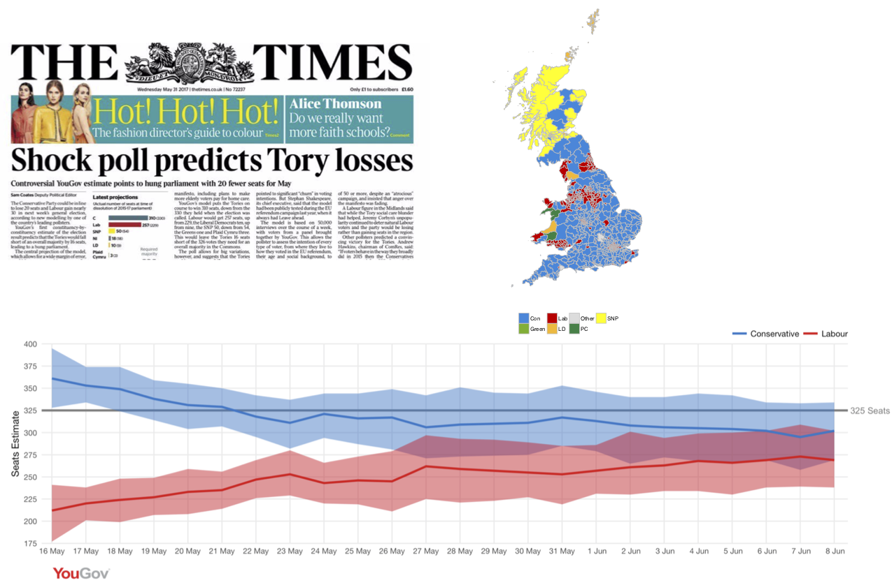
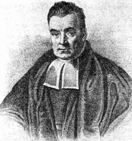
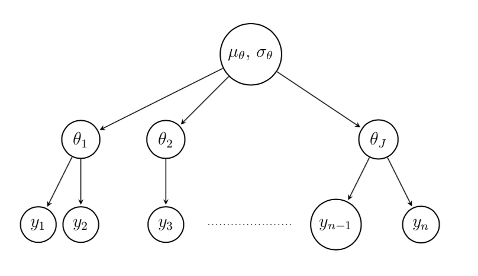

```{r setup, include=FALSE}
knitr::opts_chunk$set(echo = FALSE)
options(width=85)
```

 
## Course Schedule

| Time        | Topics                         |
|-------------|--------------------------------|
| 2:30 - 3:15 | Overview and Examples          |
| 3:15 - 4:00 | Post-stratification            |
| 4:00 - 4:45 | Multilevel Regression          |
| 4:45 - 5:30 | Bayesian inference             |
| 5:30 - 6:00 | Advanced topics and discussion |


## Course materials and basic R setup

Slides, code, and datasets can be downloaded from Github:

<https://github.com/rdrivers/mrp-aapor>

If you wish to run the examples shown in class, you will need to 

1. Download R from one of the sites listed at <https://cran.r-project.org/mirrors.html> and install. R is an open source programming environment for statistical computing.
2. (Optional) Download RStudio Desktop from [LINK]. RStudio is an integrated development environment for R. The free open source version is recommended.
3. Start R or RStudio and enter the following at the R command prompt:

\footnotesize
```{r, eval=FALSE, echo=TRUE}
install.packages(c("tidyverse", "lme4", "survey", "arm", "maps", "mapproj", 
  "gridExtra"))
```


# 1. Overview and Examples


## What is MRP?


\centering
\LARGE

Formally, **M**ultilevel **R**egression and **P**ost-stratificaiton

\medskip

\centering
\LARGE
Informally, **Mr. P**


## Who is the ubiquitous Mr. P?

\columnsbegin
\column{.3\textwidth}
```{r, out.width = "1.5in"}

```

\smallskip

\centering

Andrew Gelman

\column{.6\textwidth}

Gelman is a prolific statistician, political scientist and blogger at Columbia University.

\medskip

Developed MRP in a series of papers starting in 1997. Adapts and extends some techniques for *small area estimation* from survey statistics.

\medskip

Ideas (post-stratification, multilevel models, hierarchical Bayesian estimation) were well known, but the combination has been very effective in polling applications.

\columnsend


## . . . and his mysterious friend Stan?

\columnsbegin
\column{.3\textwidth}
```{r, out.width = "1.5in"}
knitr::include_graphics("images/ulam.jpeg")
```

\medskip

\centering

Stanislav Ulam (1909-1984)

\column{.4\textwidth}

Ulam was a physicist who invented the *Monte Carlo method* while working on the Manhattan Project.

\medskip

Stan is an open source software project developing *Markov chain Monte Carlo* (MCMC) software for statistical inference and other applications.

\column{.3\textwidth}
```{r, out.width = "1.5in"}
knitr::include_graphics("images/stan_logo.png")
```

\smallskip

\centering

<https://mc-stan.org>

\columnsend


## What problems does MRP address?

- **Selection bias.** Flexible and robust method for correcting for imbalances in sample composition, even when these are severe and can involve a large number of variables. 
- **Small area estimation.** Can provide good estimates for sub-national units (such as states, Congressional Districts, counties, *etc.*)
- **Trend analysis.** Estimate means of survey variables over time with a set of rolling cross-sections


## Selection bias: the Xbox panel


* 750,148 interviews with 345,858 Xbox users during the 2012 election campaign
* However, the sample had some problems....

(Gelman, Goel, Rivers, and Rothschild, "The Mythical Swing Voter", *Quarterly Journal of Political Science,* 2016)


## Xbox panel demographics

\centering

{height=75%}

\centering

93% were male, but there were still over 5,000 women in the sample.

  
  
## MRP estimates of 2012 voting from Xbox panel

\centering

{height=60%}

75,096 cells: 2 gender x 4 race x 4 age x 4 education x 4 party x 3 ideology x 50 states 

 
## Lesson 1

\centering

\LARGE

Under some circumstances, **big data** (large sample sizes) and **modelling** can work with severe selection bias and empty cells.

  
## Small area estimation: the 2017 UK general election

\centering




## Comparison of MRP forecasts and outcomes

\centering


## Lesson 2

\centering
\LARGE

It's possible to get pretty good estimates of **small areas** (parliamentary constituencies, congressional districts, even precincts) with effective predictors and multilevel models.


## Why do polls bounce around so much?

\centering


## Trend analysis: the 2016 US presidential election

\centering


## Lesson 3

\centering
\LARGE

Large swings in the 2012 and 2016 pre-election polls were methodological artifacts due to inadequate **post-stratification** and **modeling**.


## Ingredients for MRP and running example

**Survey** Pew Research Organization's *October 2016 Political Survey* (2,583 interviews, conducted October 20-25, 2016.)

**Survey variable** 2016 Presidential voting intention

**Covariates** Individual characteristics (from the survey) and group level predictors (2012 state vote)

**Post-strata** Age x Gender x Race x Education x State

**Stratum counts** from the November 2016 Voting and Registration Supplement to the *Current Population Survey*


## Data sources

The file `cleaned.RData` contains four R dataframes:

* `pew` - Pew Research Organization's **October 2016 Political Survey**. The original data can be found at <http://www.people-press.org/dataset/october-2016-political-survey/>. 
* `cps` - the November 2016 Voting and Registration Supplement to the **Current Population Survey**. The full dataset can be downloaded from <www.nber.org/cps/>.
* `votes12` and `votes16` - votes cast for major presidential candidates, turnout, and voting age population by state. **Vote counts** are from <https://uselectionatlas.org/> and **population counts** are from <https://www2.census.gov/programs-surveys/cps/>.

Code `clean-data.R` for creating  `cleaned.RData` is on the course Github site.


## How MRP works

**Step 1: multilevel regression** Fit a model relating the survey variable (vote) to individual and group level covariates (age, gender, race, education, state, 2012 vote).
  
**Step 2: imputation** Impute the survey variable (proportion voting Democratic) for all combinations of age x gender x race x education x state.
each cell of post-stratification (2 age x 2 gender x 3 race x 4 education x 51 state).
  
**Step 3: post-stratification** Weight the imputed values by the population count in each of the $2 \times 2 \times 3 \times 4 \times 51 = 2248$ cells.

  
## Some important concepts we will cover

 * Fit **multilevel** regression models for survey variables which are "richly parameterized" and can flexibly adjust for high dimensional selection bias.
 * Estimate models using **hierarchical Bayesian priors** to avoid over-fitting.
 * Impute using the **posterior predictive distribution** (not the sample average).
 * Use **multiple imputations** to accurately reflect the sources of uncertainty in the imputation process.

Don't worry if you don't understand the terminology -- details will follow -- but it's just **regression** and **imputation**.


# 2. Post-stratification


## Review of stratified sampling

In *stratified sampling*, we divide the population into **strata** (*e.g.*, regions) and draw samples within each stratum.

The **stratified estimator** is obtained by weighting the stratum estimates by the population size in each.

A stratified design can be more **efficient** than a simple random sample of the same size because

* Eliminates variability in the proportion of sample coming from each stratum
* Larger sample sizes allocated to more heterogeneous strata, less to homogeneous strata


## Notation for stratified sampling

**Population** $U = U_1 \cup \cdots \cup U_H$ partitioned into $H$ strata

**Sample** $S = S_1 \cup \cdots \cup S_H$ where $S_h \subset U_h$.

**Population sizes** $N = N_1 + \cdots + N_H$

**Sample sizes** $n = n_1 + \cdots + n_H$

**Sample means** $\bar y_1,\dots, \bar y_H$

**Stratified estimator** $\bar y_{\text{ST}} = \dfrac{N_1}{N} \bar y_1 + \cdots + \dfrac{N_H}{N} \bar y_H$


The stratified estimator is a **weighted** combination of the stratum means. The weights are **known** -- sampling variation comes from errors in estimating the stratum means.


## Stratification weights

An equivalent way of computing the stratified estimator is to define the **stratum weights**

$$
  w_h = \dfrac{\text{population proportion in stratum}}{\text{sample proportion in stratum}}
  = \dfrac{N_h/N}{n_h/n} 
$$
Each respondent gets the weight associated with their stratum:
$$
  \bar y_{\text{ST}} = \text{weighted average of sample values} = \dfrac{ w_{h_1} y_1 + \cdots + w_{h_n} y_n }{ w_{h_1} + \cdots + w_{h_n}}
$$
where $h_i$ and $w_{h_i}$ are the **stratum and **weight**, respectively, associated with respondent $i$.


## Variance of the stratified estimator

$$
  V(\bar y_{\text{ST}}) = \sum_{h=1}^H \left( \dfrac{N_h}{N} \right)^{\!2} \left( 1 - \dfrac{n_h}{N_h} \right) \dfrac{S_h^2}{n_h} = \dfrac{1}{n} \sum_{i=1}^n w_{h_i}^2 (1 - f_h) \dfrac{S_{h_i}^2}{n}
$$
There are three factors that determine the variance of the stratified estimator:

* Size of the **sampling fractions** $f_h = n_h / N_h$ in each stratum. Usually these are close to zero and can be ignored.
* The **within stratum variances** $sum_{i \in U_h} (y_i - \bar y_h)^2 / (N_h - 1)$. 
* Variability of the **stratum weights** $w_h$.

$S_h^2$ can be substantially less than the total variance of $y$, so there are potential large gains in efficiency from stratifying, compared to SRSWOR.

Variation in the weights tends to *increase* the standard error of the estimator, unless it's possible to allocate sample size $n_h$ proportional to $S_h^2$. 


## Post-stratification 

When the sample design is **not** stratified, it may still be feasible to use the stratified estimator if the sample can be divided into groups (called **post-strata**) whose population sizes are known.

The sample sizes in the post-strata are not fixed by design, so the variance formula only holds conditional upon the realized sample sizes $n_1,\dots,n_H$. (See Holt and Smith, "Post-stratification", *Journal of the Royal Statistical Society, Series A*, 1979.)

Even though the sample may have started with equal selection probabilities, often the proportions in the post-strata differ substantially from the population proportions. Failure to post-stratify results in large bias, but large weights may result in unstable estimates. 

Usual advice is to collapse post-strata to have at least 20 respondents per cell.


## Post-stratification in R

**Step 1** Recode survey and population data (usually from a *public use microdata* file) so that the post-stratifying variables are consistent. 

**Step 2** Choose the post-strata 

**Step 3** Collapse categories to eliminate empty cells

**Step 4** Compute the post-stratification weights

**Step 5** Estimate means and proportions (with standard errors) 


## Step 1: recode Pew data...

Variables should be `factor`s (R's version of categorical variables) with the same `levels` (categories) *in the same order*. 

\scriptsize
```{r, echo=TRUE, warning=FALSE, message=FALSE}
suppressMessages(library("tidyverse"))
load("data/cleaned.RData")
pew <- pew %>%
  filter(
    complete.cases(age, raceeth, gender, educ, vote16),
    vote16 != "nonvoter") %>%
  mutate(
    demvote = ifelse(vote16 == "clinton", 1, 0),
    age4 = factor(case_when(age < 30 ~ "18-29",
      age < 45 ~ "30-44", age < 65 ~ "45-64",
      TRUE ~ "65+")),
    race3 = fct_collapse(raceeth,
      white = c("white", "other")),
    educ4 = fct_collapse(educ,
      "hs" = c("grades 1-8", "hs dropout", "hs grad"),
      "some col" = c("some col", "assoc")))
```


## ...then do the same for CPS

\scriptsize
```{r, echo=TRUE, warning=FALSE, messages=FALSE}
cps <- cps %>%
  filter(
    complete.cases(age_top_codes,
      raceeth, gender, educ, turnout),
    turnout == "yes") %>%
  mutate(
    age4 = factor(case_when(
      age_top_codes == "<80" & age < 30 ~ "18-29",
      age_top_codes == "<80" & age < 45 ~ "30-44",
      age_top_codes == "<80" & age < 65 ~ "45-64",
      TRUE ~ "65+")),
    race3 = fct_collapse(raceeth,
      white = c("white", "other")),
    educ4 = fct_collapse(educ,
      "hs" = c("grades 1-8", "hs dropout", "hs grad"),
      "some col" = c("some col", "assoc")))
```

## Check that the datasets are consistent -- mistakes will be made!

Time spent cleaning the data at this stage is well spent.

\footnotesize
```{r, echo=TRUE, include=TRUE}
compare_distributions <- function(var, data1, data2, wgt1, wgt2, digits = 1) {
  stopifnot(all(levels(data1[[var]]) == levels(data2[[var]])))
  formula1 <- as.formula(paste(wgt1, "~", var))
  formula2 <- as.formula(paste(wgt2, "~", var))
  tbl <- rbind(round(100 * prop.table(xtabs(formula1, data1)), digits),
      round(100 * prop.table(xtabs(formula2, data2)), digits))
  row.names(tbl) <- c(substitute(data1), substitute(data2))
  tbl
}
compare_distributions("race3", pew, cps, "", "weight")
```

## Compare variables in `pew` and `cps`

\scriptsize
```{r, echo=TRUE}
compare_distributions("educ4", pew, cps, "", "weight")
compare_distributions("age4", pew, cps, "", "weight")
compare_distributions("gender", pew, cps, "", "weight")
```

## Step 2: create post-strata 

The `survey` package contains useful functions for post-stratification, including `postStratify`, `rake`, and `nonresponse`.

\footnotesize
```{r, echo=TRUE, message = FALSE, warning = FALSE}
suppressMessages(library(survey))
pop.counts <- xtabs(weight ~ age4 + gender + race3 + educ4, data = cps)
sample.counts <- xtabs(~ age4 + gender + race3 + educ4, data = pew)
pew <- mutate(pew,
  weight0 = sum(pop.counts) / sum(sample.counts))
sample.weights <- xtabs(weight0 ~ age4 + gender + race3 + 
    educ4, data = pew)
nr <- nonresponse(sample.weights, sample.counts, pop.counts)
```

\normalsize
\centering

`nr` is an object which keeps track of the cells (post-strata).


## Check for empty cells and/or large weights

\tiny
```{r, echo=TRUE}
sparseCells(nr, nrweight = 4)
```

## Look for categories adjacent to empty cells

\scriptsize
```{r, echo = TRUE, include=TRUE}
neighbours(14, nr) # use nr$index to get cell index
```


## Step 3: collapse cells

Cells 10, 11, 14 and 15 contain blacks aged 30-64 with a high school education.

\scriptsize
```{r echo=TRUE}
nr$index[,,"black","hs"]
nr <- joinCells(nr, 10, 11, 14, 15) # update the nr object
nr$index[,,"black","hs"]
```

## Eliminate remaining empty cells

Combine males and females and collapse age and education categories for minorities. Each call to `joinCells` collapses some cells and stores the result in `nr`.

\scriptsize
```{r echo=TRUE, include=TRUE}
nr <- joinCells(nr, 18, 19, 21, 22) # hisp 30-64 hs
nr <- joinCells(nr, 44, 48, 68, 72, 92, 96) # hisp 65+ >hs
nr <- joinCells(nr, 57, 61, 81, 85) # black 18-29 col+
sparseCells(nr, nrweight = 4) # no more bad cells
```

\normalsize

`NULL` means that, after collapsing, there are no empty cells or weights > 4.


## Step 4: compute weight and add to dataframe

`weights(nr)` is a four dimensional (age x gender x race x education) array of **stratum weights**. I created `get_weights` to convert the stratum weights into a vector of **individual weights**.

\footnotesize
```{r echo=TRUE}
get_weights <- function(data, nr) {
  wgt_arr <- weights(nr)
  var.names <- names(dimnames(wgt_arr))
  indexes <- data %>%
    select(var.names) %>%
    mutate_all(as.integer) %>%
    as.matrix()
  wgt_arr[indexes]
}
pew$ps.weight <- get_weights(pew, nr)
```


## Check that the post-stratification worked

\scriptsize
```{r, echo=TRUE}
compare_distributions("race3", pew, cps, "ps.weight", "weight")
compare_distributions("educ4", pew, cps, "ps.weight", "weight")
compare_distributions("age4", pew, cps, "ps.weight", "weight")
```


## Step 5: compute estimates using the new weight

Use either `xtabs` (in base R) or the `survey` package

\scriptsize
```{r, echo=TRUE, include=TRUE, warning=FALSE, message=FALSE}
round(100 * prop.table(xtabs(ps.weight ~ vote16, pew)), 1)
design <- svydesign(ids = ~ 1, weights = ~ ps.weight, data = pew)
round(100 * prop.table(svytable(~ vote16, design)), 1)
cv <- function(x) sd(x) / mean(x) # coefficient of variation
cv(pew$ps.weight)^2 # weighting loss
```


## State estimates

\footnotesize
```{r echo=TRUE}
tbl <- 100 * prop.table(xtabs(ps.weight ~ state + vote16, data = pew), 1)
round(tbl, 1)[1:10,]
```

## Plotting the estimates

State estimates are nearly useless, even if approximately unbiased.

\scriptsize
```{r echo=FALSE, warning=FALSE, fig.width=9, fig.height=4.5, fig.align="center"}
estimates <- votes16 %>%
  transmute(state, name,
    actual = 100 * clinton / turnout) %>%
  mutate(post.stratified = tbl[,"clinton"])

suppressMessages(library(ggplot2))
p1 <- ggplot(estimates, aes(actual, post.stratified)) +
  geom_abline(slope = 1, intercept = 0, col = "grey") +
  geom_point() +
  lims(x = c(0, 100), y = c(0, 100)) +
  labs(x = "Percent of votes", y = "Post-stratifed estimate") +
  theme_minimal()
p2 <- ggplot(estimates, aes(post.stratified - actual)) +
  geom_histogram(binwidth = 10, center = 0, fill = "gray") +
  labs(x = "Error in estimate") +
  theme_minimal()

suppressMessages(library(gridExtra))
grid.arrange(p1, p2, nrow = 1)
```


## Mapping the estimates

*Probably not something you'd want to share with the world.*

```{r, echo=FALSE, include=TRUE, message=FALSE, warning=FALSE}
suppressMessages(library(maps))
suppressMessages(library(mapproj))
us_map <- map_data("state")
estimates %>%
  mutate(state_name = tolower(name),
    clinton_pct = cut(post.stratified, breaks = c(-Inf, 40, 45, 50, 55, 60, 100),
      labels = c("<40", "40-45", "45-50", "50-55", "55-60", ">60"))) %>%
  ggplot(aes(map_id = state_name)) +
    geom_map(aes(fill = clinton_pct), map = us_map) +
    expand_limits(x = us_map$long, y = us_map$lat) +
    coord_map("albers", lat0 = 39, lat1 = 45) +
    scale_fill_brewer(name = "Clinton %", type = "div", palette = "RdBu") +
    theme(axis.line = element_blank()) +
    theme_void()
```


## Problems with post-stratification

**Empty cells**

* Collapsing cells increases bias
* Alternative is _raking_ (works if no empty cells in marginals)

\smallskip

**Small cells**

* Even with non-empty cells, mean estimates will be noisy if the cell size is small.
* Recommended cell size is at least 20 -- suggest collapsing cells 
    
\smallskip

**Large weights**

* Common practice is to *trim* large weights.
* Solves the wrong problem: population cell count is ok, sample cell estimate is noisy.
  

# 3. Multilevel regression

## Key ideas

* Use a regression model to **predict** values of the survey variable for each combination of covariates.
* Use a **richly parameterized model** for the data (the first level)
    + Allow intercepts and possibly slopes to vary across groups in the data ("deep interactions").
    + Use variables with many categories (such as counties or states), some of which may not be present in the data.
* Introduce a second level model for the **parameters** in the first level.
    + The parameters of the second level model are sometimes called *hyperparameters*.
    + The second level model is used to avoid overfitting. Results in *shrinkage* or *regularization*.
* Also known as hierarchical models, mixed models, random effects, variance components, repeated measures, longitudinal analysis, *etc.*


## Stein's paradox

\columnsbegin
\column{.3\textwidth}
```{r, out.width = "1.5in"}
knitr::include_graphics("images/stein.jpg")
```

\smallskip

\centering

Charles Stein (1920-2016)

\column{.5\textwidth}

The **mean square error** (or **risk**) of an estimator $\hat\theta$ of $\theta$ is
$$
  \text{MSE}(\hat\theta, \theta) = E_\theta(\hat\theta - \theta)^2
$$

An estimator $\hat\theta$ is **inadmissable** if there exists another estimator $\tilde\theta$ with smaller risk for *all* $\theta$.  The estimator $\tilde\theta$ is said to **dominate** $\hat\theta$.

\medskip

When estimating three or more means of independent normal distributions, Stein showed that the sample mean is **inadmissable**.

\columnsend


## A tale of three estimators

To keep things simple, we start with models for vote by state without any covariates.

**No pooling** estimate the model separately for each state (by a regression on 51 state dummies)

**Complete pooling**  estimate a single **grand mean** (equivalent to a regression with just an intercept)

**Partial pooling** estimate a *random effects* model (to be explained shortly -- think of it as a compromise between no pooling and complete pooling)

\bigskip
\small

(For pedagogical purposes, we will use *linear* instead of *logistic regression* in this section. The same concepts apply to nonlinear model.)


## Fixed effects (no pooling)

We use `lm` to estimate a model with state dummies and no intercept (so the estimates are the predicted Clinton vote in each state).

\scriptsize
```{r, echo=TRUE}
no.pooling <- lm(demvote ~ state - 1, data = pew)
no.pooling <- data_frame(
    state = gsub("state", "", names(coef(no.pooling))),
    no.pooling = 100 * coef(no.pooling)) %>%
  mutate(state = factor(state, levels = levels(pew$state)))
head(no.pooling)
```


## Grand mean (complete pooling)

The grand mean can be computed in **three equivalent ways**:

\scriptsize
```{r, echo=TRUE}
round(100 * mean(pew$demvote), 1) # 1. mean of dichotomous indicator
round(100 * prop.table(xtabs(~ demvote, data = pew)), 1) # 2. cross-tabulation
complete.pooling <- lm(demvote ~ 1, data = pew) # 3. intercept in regression
complete.pooling <- 100 * coef(complete.pooling)
round(complete.pooling, 1)
```


## Random effects (partial pooling)

Estimate a model with one **fixed effect** (the grand mean) plus **random effects** for each state,
$$
  \text{vote} = \text{grand mean} + \text{state effect} + \text{individual error}
$$
or, in symbols,
$$
   y_i = \mu + \alpha_{j_i} + \epsilon_i \qquad (j_i = \text{state of respondent})
$$
where
$$
  \alpha_1,\dots,\alpha_J \stackrel{\text{iid}}{\sim} \text{Normal}(0, \sigma_\alpha) \qquad
  \epsilon_1,\dots,\epsilon_n \stackrel{\text{iid}}{\sim} \text{Normal}(0, \sigma_\epsilon)
$$
The grand mean $\mu_i$ is a **fixed effect** while the state effects $\alpha_j$ are **random effects** (assumed to be $\text{Normal}(0, \sigma_\alpha)$). 

In classical statistics, parameters (like $\mu$, $\sigma_\epsilon$ and $\sigma_\alpha$) are **estimated** while random effects are **predicted**. 

## What's the difference between fixed and random effects models?

In both models,
$$
  y_i = \mu + \alpha_{j_i} + \epsilon_i
$$
with the only difference being

* **Fixed effects** $\alpha_1,\dots,\alpha_J$ are *unknown* parameters to be estimated.
    + $E(y_i) = \mu + \alpha_{j_i}$ and $V(y_i) = \sigma_\epsilon^2$
* **Random effects** $\alpha_1,\dots,\alpha_J$ are *unknown* random variables to be predicted.
    + $E(y_i) = \mu$ and $V(y_i) = \sigma_\alpha^2 + \sigma_\epsilon^2$
    + But $E(y_i | \alpha_{j_i}) = \mu + \alpha_{j_i}$ and $V(y_i | \alpha_{j_i}) = \sigma_\epsilon^2$
    
If you find this confusing, you are not alone. Gelman and Hill argue that the only meaningful difference is that the $\alpha_j$ are modelled in one and not in the other.


## Predicting random effects

The default method for R's `lmer` function (in the `lme4` package) is *REML* (residualized or restricted maximum likelihood), which is unbiased for linear models.

\scriptsize
```{r, echo=TRUE}
suppressMessages(library(lme4))
partial.pooling <- lmer(demvote ~ 1 + (1 | state), data = pew)
partial.pooling
```

## Extracting predictions

\scriptsize
```{r, echo=TRUE}
fixef(partial.pooling) # grand mean
ranef(partial.pooling)$state %>% head(4) # state effects
coef(partial.pooling)$state %>% head(4) # state predictions
```


## Which is better?

\scriptsize
```{r echo=FALSE}
partial.pooling <- coef(partial.pooling)$state %>%
  as_data_frame(rownames = "state") %>%
  transmute(state = factor(state, levels = levels(pew$state)),
    partial.pooling = 100 * `(Intercept)`)
estimates <- estimates %>%
  left_join(no.pooling, by = "state") %>%
  left_join(partial.pooling, by = "state") %>%
  mutate(n = as.integer(xtabs(~ state, data = pew)))
estimates
```


```{r echo=FALSE, include=FALSE}
rmse <- function(est, act) sqrt(mean((est - act)^2, na.rm = TRUE))
RMSE <- estimates %>%
  summarize(complete.pooling = rmse(complete.pooling, actual),
    no.pooling = rmse(no.pooling, actual),
    partial.pooling = rmse(partial.pooling, actual)) %>%
  unlist()
RMSE
```

\normalsize

The RMSE is about the same for *no pooling* (`r round(RMSE["no.pooling"], 1)`%) and *complete pooling* (`r round(RMSE[
"complete.pooling"], 1)`%), but substantially smaller for *partial pooling* (`r round(RMSE["partial.pooling"], 1)`%).


## 2016 U.S. election: estimates *vs.* actuals

```{r echo=FALSE, message=FALSE, warning=FALSE, fig.height=4.5, fig.width=9, fig.align="center"}
p1 <- ggplot(estimates, aes(actual, no.pooling)) +
  geom_point() +
  labs(title = "No pooling", x = "Percent of voters",
    y = "Percent of voters") +
  lims(x = c(0,100), y = c(0,100)) +
  theme_minimal()
p2 <- ggplot(estimates, aes(actual, partial.pooling)) +
  geom_point() +
  labs(title = "Partial pooling", x = "Percent of voters",
    y = "Percent of voters") +
  lims(x = c(0,100), y = c(0,100)) +
  theme_minimal()
suppressMessages(library(gridExtra))
grid.arrange(p1, p2, nrow = 1)
```


## Shrinkage

```{r echo=FALSE, fig.align="center"}
na.omit(estimates) %>%
  select(-post.stratified) %>%
  rename("Actual" = actual, "No pooling" = no.pooling,
    "Partial pooling" = partial.pooling) %>%
  gather(Estimator, Percentage, -state, -name, -n) %>%
  mutate(Estimator = factor(Estimator, levels = c("Post-stratified",
    "No pooling", "Partial pooling", "Actual"))) %>%
  ggplot(aes(Estimator, Percentage, group = state, color = n)) +
    geom_line(size = 0.7) +
    scale_color_gradientn(colors = blues9[-1]) +
    lims(y = c(0, 100)) +
    theme_minimal()
```


## What *exactly* is a random effects estimator?

The random effects/partial pooling estimate of a group mean is a weighted average of the fixed effects/no pooling estimate and the grand mean/complete pooling estimate.

$$
  \hat\theta_j^{\text{RE}} = w_j \, \bar y_j + (1 - w_j) \, \bar y
$$

* The weight on the no pooling estimator $\bar y_j$ is proportional to sample size $n_j$ in group $j$ and inversely proportional to the **within group variance**.
* The weight on the complete pooling is inversely proportional to the **between group variance**.
* Sometimes referred to as an **empirical Bayesian estimator**. The amount of shrinkage is data dependent.


## Adding individual covariates: fixed effects

To get better predictions, let's add a covariate -- **gender** -- to the model. There are now three *fixed effects* estimators:

**Complete pooling** estimate a single slope and single intercept for all states

**No pooling** estimate separate intercepts and slopes for each state

**Complete pooling of slopes, no pooling of intercepts** estimate separate intercepts for each state and a common slope

*(It rarely makes sense to estimate separate slopes and a common intercept, so we ignore this possibility.)*


## Complete pooling: common intercepts and slopes

$$
  y_i = \alpha + \beta x_i + \epsilon_i \qquad \epsilon_i \stackrel{\text{iid}}{\sim} \text{Normal}(0, \sigma_\epsilon)
$$

\scriptsize
```{r, echo=TRUE}
pew <- mutate(pew, female = ifelse(gender == "female", 1, 0))
fit1 <- lm(demvote ~ 1 + female, data = pew)
arm::display(fit1)
```

\normalsize

$\hat\beta = 0.14$ implies a 14% gender gap (42% of men voted for Clinton *vs.* 56% of women).


## No pooling: separate intercepts and slopes

$$
  y_i = \alpha_{j_i} + \beta_{j_i} x_i + \epsilon_i 
$$

\tiny
```{r, echo=TRUE}
fit2 <- lm(demvote ~ 0 + state + state:female, data = pew)
coef.fit2 <- as.matrix(coef(fit2))
round(coef(fit2)[c(1:5, 90:98)], 2)
```

\normalsize
It's impossible to estimate the slope in Wyoming:

\tiny
```{r, echo=FALSE}
options(width = 100)
xtabs(~ gender + state, data = pew) # no men in WY
options(width = 85)
```

```{r echo=FALSE, include=FALSE}
coef.fit2 <- coef(fit2)
coef.fit2 <- as.matrix(data.frame(intercept = coef.fit2[1:48],
  slope = coef.fit2[50:97], row.names =
  gsub("state", "", names(coef.fit2)[1:48])))
```


## Separate intercepts with common slope

$$
  y_i = \alpha_{j_i} + \beta x_i + \epsilon_i
$$

\scriptsize
```{r echo=TRUE}
fit3 <- lm(demvote ~ state + female - 1, data = pew)
coef.fit3 <- coef(fit3)
names(coef.fit3) <- gsub("state", "", names(coef.fit3))
round(coef.fit3, 2)
```


## Which should you believe?

```{r, echo=FALSE, fig.align="center"}
par(mfrow=c(1,2))
plot.gender.by.state <- function(main, coefs, fixef) {
  n <- nrow(coefs)
  x <- rep(c(0,1), rep(n, 2))
  y <- 100 * c(coefs[[1]], coefs[[1]] + coefs[[2]])
  plot(x = x, y = y, pch = 19, cex = 0.5, xlim = c(0, 1),
    ylim = c(0, 100), main = main,xlab = "Gender",
    ylab = "Percent voting for Clinton", axes = FALSE)
  axis(1, at = c(0, 1), labels = c("Male", "Female"))
  axis(2, at = seq(0, 100, 20))
  for (i in seq_len(n)) lines(x = c(0, 1),
    y = c(y[i], y[i+n]), col = "grey", lwd = 0.5)
  abline(100 * fixef, col = "red3", lwd = 2)
}
plot.gender.by.state("No pooling", as_data_frame(coef.fit2)[-49,],
  coef(fit1))
coef.fit3.df <- data_frame(Intercept = coef.fit3[-length(coef.fit3)],
  Slope = coef.fit3[length(coef.fit3)])
plot.gender.by.state("Common slope", coef.fit3.df, coef(fit1))
par(mfrow=c(1,1))
```


## Gender gaps in 2016 Exit poll

\centering


## Multilevel models with a single covariate

**Varying intercepts, common slope** 

$$
  y_i = \mu + \alpha_{j_i} + \beta x_i + \epsilon_i
$$

* The intercept for state $j$ is $\mu + \alpha_j$. 
* The slope (gender gap) is $\beta$ (same for all states).

**Varying intercepts and slopes** 

$$
  y_i = \mu + \alpha_{j_i} + \beta x_i + \gamma_{j_i} x_i + \epsilon_i
$$

* The intercept for state $j$ is $\mu + \alpha_j$.
* The slope (gender gap) for state $j$ is $\beta + \gamma_j$ (varies).


## Random effects: varying intercepts, common slopes

\scriptsize
```{r echo=TRUE}
# Varying intercept and common slope
fit4 <- lmer(demvote ~ 1 + female + (1 | state), data = pew)
fit4
```


## Random effects: varying intercepts and slopes (first try)

\tiny
```{r, echo=TRUE}
(fit5 <- lmer(demvote ~ 1 + female +  (1 + female | state),
  data = pew)) # fails to converge
```


## Fixing the convergence failure (by centering covariates)

\scriptsize
```{r echo=TRUE}
pew <- mutate(pew, female.c = female - 0.5)
fit6 <- lmer(demvote ~ 1 + female.c + (1 + female.c | state),
  data = pew)
fixef(fit6) # not comparable to prior models
head(coef(fit6)$state)
```

\normalsize

(No need to wrestle with `lmer` if you use Stan -- which is up next.)


## Unscale the estimates for comparability

\scriptsize
```{r, echo=TRUE}
fixef.fit6 <- fixef(fit6)
fixef.fit6[1] <- fixef.fit6[1] - 0.5 * fixef.fit6[2]
coef.fit6 <- coef(fit6)$state
coef.fit6[[1]] <- coef.fit6[[1]] - 0.5 * coef.fit6[[2]]
fixef.fit6
head(coef.fit6)
```


## Comparing the random effects estimates

Gender gaps are correlated with state effects ($r = 0.56$).

```{r, echo=FALSE, fig.width=9, fig.height=5}
par(mfrow=c(1,2))
plot.gender.by.state("Varying intercepts, common slope",
  coef(fit4)$state, fixef(fit4))
plot.gender.by.state("Varying intercepts and slopes",
  coef.fit6, fixef.fit6)
par(mfrow=c(1,1))
```


## Adding group-level covariates to the model

Add a **group-level covariate** (2012 vote) to the model. This is impossible in the no-pooling model, since group level variables are **collinear** with state indicators. 

As before, $i$ indexes respondents and $j$ indexes states. The variables are:
$$
\begin{aligned}
  y_i &= \text{respondent 2016 vote (1 = Clinton, 0 = other)} \\
  x_i &= \text{respondent gender (1 = female, 0 = male)} \\
  z_j &= \text{proportion in state voting for Obama in 2012}
\end{aligned}
$$
At the respondent level, both intercepts and slopes vary by group (state):
$$
  \text{\textbf{Respondent model}} \quad  y_i = \alpha_{j_i} + \beta_{j_i} x_i + \epsilon_i \qquad (i = 1,\dots,n) 
$$
The state intercepts and slopes are modelled as:
$$
  \text{\textbf{Group model}} \qquad \alpha_j = \mu + \delta z_j + \eta_j \qquad 
  \beta_j = \gamma + \xi_j
$$
The errors are all assumed to be iid normal with zero means:
$$
  \epsilon_i \stackrel{\text{iid}}{\sim} \text{Normal}(0, \sigma_\epsilon)
  \qquad 
  \eta_j \stackrel{\text{iid}}{\sim} \text{Normal}(0, \sigma_\eta) 
  \qquad
  \xi_j \stackrel{\text{iid}}{\sim} \text{Normal}(0, \sigma_\xi)
$$

## An equivalent version of the model

We can move covariates from the **upper** (group) level to the **lower** (respondent) level without changing anything:
$$
  y_i = \mu + \gamma x_i + \delta z_{j_i} + \left( \eta_{j_i} + \xi_{j_i} x_i + \epsilon_i \right)
$$
The first three terms are **fixed effects**, while the last terms (in parentheses) are **random effects**.

The random effects in this formulation all have **mean zero**, which is required by `lmer`. This assumption is not restrictive -- anything on the RHS of the group model with non-zero mean can be moved to the respondent level fixed effects.


## Estimating models with covariates at both levels

Join group level covariates to respondent data:

\scriptsize
```{r, echo=TRUE}
obama12 <- votes12 %>%
  mutate(obama12 = obama / turnout) %>%
  select(state, obama12)
pew <- left_join(pew, obama12, by = "state")
fit7 <- lmer(demvote ~ 1 + female.c + obama12 + (1 + female.c | state), data = pew)
```

\tiny
```{r}
options(width = 105)
arm::display(fit7)
options(width = 85)
```


## First attempt at MRP

We can use the R `predict` function to **impute** `demvote` onto `cps`:

\scriptsize
```{r echo=TRUE, warning=FALSE, message=FALSE}
cps <- cps %>%
  mutate(female = ifelse(gender == "female", 1, 0),
    female.c = female - 0.5) %>%
  left_join(obama12, by = "state")
prob <- predict(fit7, newdata = cps, allow.new.levels = TRUE)
mrp1 <- cps %>%
  mutate(prob = prob) %>%
  group_by(state) %>%
  summarize(mrp1 = 100 * weighted.mean(prob, weight))
estimates <- left_join(estimates, mrp1, by = "state")
head(estimates)
```


## Plotting first MRP estimates

\centering

```{r echo=FALSE, message=FALSE, warning = FALSE, fig.width=4.5, fig.height=4, fig.aling="center"}
RMSE["mrp1"] <- with(estimates, rmse(mrp1, actual))
ggplot(estimates, aes(actual, mrp1)) +
  geom_abline(intercept = 0, slope = 1, col = "grey") +
  geom_point(size = 1.5) +
  lims(x = c(0, 100), y = c(0, 100)) +
  labs(x = "Percentage of vote for Clinton", y = "Estimate") +
  theme_minimal()
```

\normalsize

The MRP estimates are now pretty good (RMSE = `r round(RMSE["mrp1"], 2)`)!


## Summary of multilevel models

* Multilevel models allow us to estimate models with large numbers of parameters and still get sensible results.
* Multilevel models **shrink** or **regularize** estimates.
    + Random effect estimates of group parameters are shrunk toward a "grand mean" effect.
* The amount of **shrinkage** in estimating a parameter depends upon:
    + How much data is available to estimate the parameter.
    + How much the parameter varies across groups.
* Substantial improvements can be made by adding **group-level predictors** (like past vote).
* Also possible to estimate multilevel **logistic regressions** using `glmer`, but we will focus on Bayesian estimation instead.


# 4. Bayesian inference


## What is Bayesian statistics?

\columnsbegin
\column{.3\textwidth}
```{r, out.width = "1.5in"}

```

\smallskip

\centering

Thomas Bayes (1701-61)

\column{.5\textwidth}

Bayesian statistics is a method for combining **prior information** with **data** to draw inferences.

\medskip

Probabilities are **subjective measures of uncertainty** and, in Bayesian inference, can be applied to *anything*, including events that have already happened.

\medskip

Bayesian inference seems particularly well suited for situations where there is uncertainty about the sampling process and no **objective sampling distribution**.

\columnsend


## Advantages and disadvantages of Bayesian inference

\columnsbegin
\column{.3\textwidth}
```{r, out.width = "1.5in"}

```

\smallskip

\centering
\small

Cotton and Bayes 

family vault

\footnotesize

(Bunhill Fields, London)

\column{.3\textwidth}

\normalsize

**Advantages**

* Does not depend on having large samples
* Can incorporate prior (non-sample) information
* Better estimates of variance parameters
* Simpler conceptual framework, avoids *ad hockery*

\column{.3\textwidth}

\normalsize

**Disadvantages**

* Requires specification of prior probability distributions
* Inferences are not "objective"
* Better estimates of variance parameters
* Takes *much* more computational effort

\columnsend


## Basic ideas

In Bayesian statistics, both data and parameters are considered to be random variables. The important distinction is between what is *observed* (the data, except possibly for missing values) and what isn't (parameters, such as regression coefficients). 

As in classical statistics, we specify a *model* (probability distribution) for the data, which depends on some unknown parameters. In addition, we summarize any information that we might have about the unknown parameters using a *prior probability distribution*.

Bayesian inference uses Bayes theorem to combine the prior information with the data to obtain a *posterior probability distribution* for the parameters. 


## Notation for Bayesian analysis

**Data** $y = (y_1,\dots,y_n)$

**Parameters** $\theta = (\theta_1,\dots,\theta_k)$

**Prior distribution** $p(\theta) = p(\theta_1,\dots,\theta_k)$

**Model** $p(y|\theta)$ (*a.k.a.* the **likelihood function**)

**Posterior distribution** $p(\theta | y)$


## Example: What is the average airfare to AAPOR in Denver?

```{r echo=FALSE, include=FALSE}
post.precis <- 1 / 100^2 + 3 / 150^2
post.mean <- (400 / 100^2 + 300 * 3 / 150^2) / post.precis
post.sd <- 1 / sqrt(post.precis)
```


**Population parameters**

* $\theta = \text{population average fare}$ 
* $\sigma = \text{population s.d.} = 150$ (assumed to be known)

**Data** My airfare was $y_1 = 161$ and two friends spent $y_2 = 250$ and $y_3 = 489$.

$$
  \bar y = \dfrac{161 + 250 + 489}{3} = 300 \qquad n = 3
$$

**Model** $y_1,\dots,y_n$ are independent $\text{Normal}(\theta, 150)$ random variables 

**Prior information** $\theta \sim \text{Normal}(400, 100)$ (so $P(200 < \theta < 600) \approx 95\%$)

**Posterior distribution** $\theta | y_1,y_2,y_3 \sim \text{Normal}(`r round(post.mean)`, `r round(post.sd)`)$


## The posterior distribution

\centering

From Bayes' Theorem, it can be shown that $\theta | y \sim \text{Normal}(343, 65)$.


```{r echo=FALSE, fig.width=4.5, fig.height=2.75, fig.align="center"}
ggplot(data_frame(theta = c(0, 700) ), aes(theta)) +
  stat_function(fun = dnorm, color = "red",
    args = list(mean = 300, sd = 200 / sqrt(3))) +
  stat_function(fun = dnorm, color = "blue",
    args = list(mean = 400, sd = 100)) +
  stat_function(fun = dnorm, color = "purple",
    args = list(mean = post.mean, sd = post.sd)) +
  labs(x = quote(theta), y = "") +
  scale_x_continuous(breaks = seq(0, 700, 100)) +
  scale_y_continuous(breaks = NULL) +
  theme_minimal()
```

*The posterior is a compromise between the prior and the likelihood.*


## Relationship between prior and posterior mean

In the normal model, the **posterior mean** is a weighted average of the **prior mean** and the **sample mean**.
$$
\begin{aligned}
  \text{posterior mean} &= \text{weight} \times \text{prior mean} + (1 - \text{weight})  \times \text{sample mean} \\[10pt]
  \text{weight} &= \dfrac{ \text{prior precision} }{ \text{prior precision} + \text{sample precision} } \\[3pt]
  \text{prior precision} &= \dfrac{1}{ \text{prior variance} } \\[3pt]
  \text{sample precision} &= \dfrac{n}{ \text{data variance} }
\end{aligned}
$$

When the sample size is large, the weight on the prior becomes small. However, when the sample size is small, the posterior **shrinks** the sample mean toward the prior.


## Markov Chain Monte Carlo (MCMC)

For simple models (like the normal model with a normal prior), the posterior can be derived **analytically**. This is impossible for most models and priors, which limited the application of Bayesian methods before MCMC (about 1990).

MCMC is a technique for **simulating** draws from a probability distribution. With simulated draws, we can:

 * Use a histogram or density plot to see what the **posterior distribution** looks like.
 * Compute an estimate of the **posterior mean** (the average of the draws) or **posterior standard deviation** (the s.d. of the draws)
 * Compute quantiles to obtain **credible intervals** (a.k.a. "confidence intervals").
 
Programs like BUGS and Stan automate most of this process.
 

## Instructions for installing Stan on MacOS

<https://github.com/stan-dev/rstan/wiki/RStan-Getting-Started>

1. Install a C++ compiler  (Xcode for MacOS or Rtools for Windows)
    
2. Create a `Makevars` file your `.R` folder (in your home directory):

\scriptsize
```{r echo=TRUE, eval=FALSE}
CC=clang
CXX=clang++ -arch x86_64 -ftemplate-depth-256
CXXFLAGS=-O3 -mtune=native -march=native -Wno-unused-variable \
  -Wno-unused-function -Wno-macro-redefined \
  -Wno-unused-local-typedefs -Wno-c++11-inline-namespace \
  -Wno-unneeded-internal-declaration -Wno-unknown-pragmas
```

\normalsize

3. Install `rstan` from CRAN

\scriptsize
```{r echo=TRUE, eval=FALSE}
install.packages(c("rstan", "rstanarm"))
```


## A first Stan program

**Model** $y_1,\dots,y_n \stackrel{\text{iid}}{\sim} \text{Normal}(\theta, \sigma)$ ($\sigma = 150$)

**Prior** $\theta \sim \text{Normal}(\theta_0, \omega_0)$ ($\theta_0 = 350$, $\omega_0 = 100$)

\scriptsize
```{r, echo=TRUE}
model_code <- "data {
  int n;
  real y[n];
  real theta_0;
  real<lower=0> omega_0;
  real sigma;
}
parameters {
  real theta;
  }
model {
  theta ~ normal(theta_0, omega_0);
  for (i in 1:n) {
    y[i] ~ normal(theta, sigma);
  }
}"
```


## Components of a Stan program

**Data** (what you know)

\scriptsize
```{r eval=FALSE, echo=TRUE}
data {
  int n;  // number of data points
  real y[n]; // data on fares
  real theta_0; // prior mean
  real<lower=0> omega_0; // prior sd
  real sigma; // sd of fares
}
```

\normalsize

**Parameters** (what you don't know)

\scriptsize
```{r eval=FALSE, echo=TRUE}
parameters {
  real theta; // mean fare
}
```

\normalsize

**Model** (joint distribution of data and parameters)

\scriptsize
```{r eval=FALSE, echo=TRUE}
model {
  theta ~ normal(theta_0, omega_0); // prior
  for (i in 1:n)
    y[i] ~ normal(theta, sigma); // likelihood
```


## Running a Stan program from R

To run a Stan program from R, you will need:

* Load `rstan` package (using the `library` function)
* Your Stan `model_code` (as a string or from an external file)
* A named list `data` (containing all of the items listed in the Stan `data` block)
* Call the `stan` function with `model_code` and `data` as arguments.

Stan returns draws from the posterior distribution of the parameters, arranged into a three-dimensional array (draws x chains x parameters).


## Example (continued)

\footnotesize
```{r, echo=TRUE,warning=FALSE,message=FALSE}
suppressMessages(library(rstan))
rstan_options(auto_write = TRUE)
options(mc.cores = parallel::detectCores())
y <- c(161, 250, 489)
data <- list(y = y, n = length(y), theta_0 = 350,
  omega_0 = 150, sigma = 100)
sims <- stan(model_code = model_code, data = data,
  chains = 4, iter = 500, seed = 1234)
```

\normalsize

This will simulate four **chains** of length `iter = 500`. 

\smallskip

By default, half of each chain is for **warmup**, so the result will be a 500 x 4 x 1 array (iterations x chains x parameters).

 
## Stan output

\scriptsize
```{r, echo=TRUE, include=TRUE}
print(sims)
```


## How to read Stan output

* `mean` is the **posterior mean** -- estimated to be 302.94 for $\theta$.
* `se_mean` is the **monte carlo standard error**.
  * The value 2.63 tells you that only the first two digits are reliable -- the point estimate is probably between 297 and 309.
  * To make this smaller, redo the simulations with a larger value of `iter`.
* `sd` is the **posterior standard deviation** of $\theta$ -- beyond the error in the computation of the point estimate.
* The percentages are **posterior quantiles**.
  * The 95% **credible interval** is 200.47 to 404.01.
* `Rhat` is a **convergence** diagnostic. You should look for values near one.


## Weakly informative priors

Bayesian inference is often criticized for being *subjective* since different priors will yield different inferences.

**Non-informative priors** can be used to reproduce many classical frequentist ("objective") results. Sometimes these priors are not *proper* (*e.g.*, $\theta$ is uniformly distributed on $\Bbb{R}$).

**Weakly informative priors** purposely include less information than we actually have, but still provide some *regularization* (shrinkage). 

For example, logistic regression coefficients are rarely greater than five or six (the difference between the top and bottom decile is about 4.4, between the .95 and .05 quantiles is about 5.9). In a linear model, a ``six sigma'' effect would be considered extremely large by any standard.


## Priors on standard deviations

In real world applications, we do not know the standard deviation of the data, so there are two unknown parameters ($\mu$ and $\sigma$).

Since $\sigma > 0$, we need to use a prior distribution for $\sigma$ that assigns zero probability to negative numbers. There are many possible choices.

Traditionally, variance priors were selected for computational convenience, but with modern MCMC methods this is no longer necessary.

Gelman, "Prior distributions for variance parameters in hierarchical models," *Bayesian Analysis* (2006) recommends the *Folded noncentral t* distribution (the distribution of the absolute value of a noncentral $t$ random variable). A *half normal* prior may also be suitable.


## Stan code for estimating both mean and SD

Move `sigma` from the `data` block to the `parameters` block.

\scriptsize
```{r stan_mean_sd, echo=TRUE, warning=FALSE, message=FALSE}
data <- list(y = y, n = length(y), theta_0 = 350, omega_0 = 150)
model_code <- "data {
  int n;
  real y[n];
  real theta_0;
  real omega_0;
}
parameters {
  real theta;
  real<lower=0> sigma; // moved to parameter block
}
model {
  theta ~ normal(theta_0, omega_0);
  sigma ~ normal(150, 150);
  y ~ normal(theta, sigma); // assumed iid
}"
sims <- stan(model_code = model_code, data = data,
  iter = 500, seed = 1234)
```


## Output from two-parameter model

\scriptsize
```{r mean_sd_output, echo=TRUE}
print(sims)
```


## Graphical display of parameters

\footnotesize
```{r, fig.height=4.5,message=FALSE,warning=FALSE}
plot(sims)
```


## Traceplot

\footnotesize
```{r, fig.height=4.5,message=FALSE,warning=FALSE}
traceplot(sims)
```

## Hierarchical priors

Multilevel models contain many parameters and it is difficult to specify **high dimensional priors**. In a model for respondents in U.S. states, we might have intercepts for each state, each of which would need to be assigned a prior distribution.

Instead, we use **hierarchical priors** where the priors for the model parameters depend upon **hyperparameters**. That is, we model relationships between the many model parameters using a second level model. 

Hierarchical priors are **data dependent**. We infer relationships between model parameters using observed patterns in the data.   

For example, we can model state intercepts in a voting model using past vote. To the extent that 2016 respondents in states that voted Republican in 2012 also say they will vote Republican in 2016, we can infer a correlation between past vote and state intercepts in the 2016 model.


## Example: a simple two-level model



                    
## Notation for hierarchical normal model

**Individuals** indexed by $i = 1,\dots,n$.

**Groups** indexed by $j = 1,\dots,J$. Individual $i$ belongs to group $j_i$ 

**Data Model** $y_i \stackrel{\text{ind}}{\sim} \text{Normal}(\theta_{j_i}, \sigma_y)$

**Group Model** $\theta_j \stackrel{\text{ind}}{\sim}(\mu_\theta, \sigma_\theta)$ (Hierarchical prior)

**Hyper Prior** $\mu_\theta \sim \text{Uniform}(-\infty, \infty)$ and $\sigma_\theta \sim \text{Normal}_+(0, 5)$

We can then use Bayes' Theorem to derive the posterior distribution of both the group parameters ($\theta_1,\dots,\theta_J$) and the hyperparameters ($\mu_\theta, \sigma_\theta$).


## First hierarchical model in Stan

\scriptsize
```{r hb1, echo=TRUE, warning=FALSE, message=FALSE}
data <- with(pew, list(y = demvote, group = as.integer(state),
  n = nrow(pew), J = nlevels(state)))
code <- "data {
  int n; // number of respondents
  int J; // number of groups (states)
  int<lower=0, upper=1> y[n]; // demvote
  int<lower=1, upper=J> group[n]; // state index
}
parameters {
  real mu_theta; // hyper parameters
  real<lower=0> sigma_theta; 
  vector[J] theta; // group parameters
}
model {
  sigma_theta ~ normal(0, 5);
  for (j in 1:J)
    theta[j] ~ normal(mu_theta, sigma_theta);
  for (i in 1:n)
    y[i] ~ bernoulli_logit(theta[ group[i] ]);
}"
sims <- stan(model_code = code, data = data)
```


## Stan output

\tiny
```{r}
print(sims)
```


## A plot of the state estimates

\centering

```{r warning=FALSE, message=FALSE, fig.width=5}
names(sims) <- c("mu_theta", "sigma_theta", levels(pew$state), "lp__")
plot(sims, par = "theta")
```


## Add a covariate to the model

\scriptsize
```{r hb2, echo=TRUE, warning=FALSE, message=FALSE}
data <- with(pew, list(y = demvote, group = as.integer(state),
  x = female, n = nrow(pew), J = nlevels(state)))
code <- "data {
  int n; // number of respondents
  int J; // number of groups (states)
  int<lower=0, upper=1> y[n]; // demvote
  int<lower=1, upper=J> group[n]; // state index
  vector[n] x; // added covariate (gender)
}
parameters {
  real mu_alpha; // mean intercept
  real<lower=0> sigma_alpha; // sd intercept
  real beta; // coefficient of gender
  vector[J] alpha; // group intercepts
}
model {
  sigma_alpha ~ normal(0, 5);
  for (j in 1:J)
    alpha[j] ~ normal(mu_alpha, sigma_alpha);
  for (i in 1:n)
    y[i] ~ bernoulli_logit(alpha[group[i]] + beta * x[i]);
}"
sims <- stan(model_code = code, data = data)
```


## Simplifying the computations

Make a `model.matrix` $X$ in R for fixed effects.

\footnotesize
```{r, echo=TRUE, include = TRUE}
X <- model.matrix(~ 1 + age4 + gender + race3 + educ4 +
    region + qlogis(obama12), data = pew)
```

\scriptsize
```{r}
head(X, 4)
```


## Simplifying the computations (continued)

Add `X = X` to the R `data` list and modify the Stan code to use matrix multiplication:

\scriptsize
```{r echo=TRUE, eval=FALSE}
data {
  ...
  matrix[n, k] X; // covariate matrix
}
parameters {
  vector[k] beta; // fixed effects
  ...
}
model {
  vector[n] Xb; 
  Xb = X * beta;  
  ...
}

```


## Simplifying the computations (continued)

* Move hierarchical means into fixed effects, so mean of random effects is zero.
* Random effects are usually easier to program directly in Stan.
* Sometimes helpful to standardized parameters and multiply by the SD.
* Stan's default is to assume elements of a vector are independent.

\scriptsize
```{r echo=TRUE, eval=FALSE}
parameters {
  real<lower=0> sigma_alpha; // sd intercept
  vector[J] alpha; // group intercepts
  ...
}
model {
  sigma_alpha ~ normal(0.2, 1); // prior for sd
  alpha ~ normal(0, 1); // standardized intercept
  ...
  for (i in 1:n)
    Xb[i] += sigma_alpha * alpha[ group[i] ];
  y ~ bernoulli_logit(Xb); 
}

```


## Hierarchical model with multiple covariates

\scriptsize
```{r hb3, echo=TRUE, message=FALSE, warning=FALSE}
model_code <- "data {
  int n; // number of respondents
  int k; // number of covariates
  matrix[n, k] X; // covariate matrix
  int<lower=0, upper=1> y[n]; // outcome (demvote)
  int J; // number of groups (states)
  int<lower=1, upper=J> group[n]; // group index
}
parameters {
  vector[k] beta; // fixed effects
  real<lower=0> sigma_alpha; // sd intercept
  vector[J] alpha; // group intercepts
}
model {
  vector[n] Xb;
  beta ~ normal(0, 4);
  sigma_alpha ~ normal(0.2, 1); // prior for sd
  alpha ~ normal(0, 1); // standardized intercepts
  Xb = X * beta;
  for (i in 1:n)
    Xb[i] += sigma_alpha * alpha[ group[i] ];
  y ~ bernoulli_logit(Xb);
}"
```


## Estimating the model in R

\scriptsize
```{r echo=TRUE, warning=FALSE, message=FALSE}
X <- model.matrix(~ 1 + age4 + gender + race3 + educ4 +
  region + qlogis(obama12), data = pew)
data <- list(n = nrow(X), k = ncol(X), X = X, y = pew$demvote,
  J = nlevels(pew$state), group = as.integer(pew$state))
sims <- stan(model_code = model_code, data = data,
  seed = 1234)
```

\normalsize

Coefficients in the output are in the same order specified in the `model` block:

\scriptsize
```{r echo=TRUE, eval=FALSE}
parameters {
  vector[J] alpha; // group intercepts
  real<lower=0> sigma_alpha; // sd intercept
  vector[k] beta; // fixed effects
}
```

\tiny
```{r echo=FALSE}
options(width = 105)
names(sims)
options(width = 85)
```


## Rename the coefficients for easier reading

\scriptsize
```{r echo=TRUE}
coef.names <- c(colnames(X), "sigma_alpha", levels(pew$state), "lp__")
names(sims) <- coef.names
```

\tiny
```{r}
options(width = 105)
names(sims)
options(width = 85)
```


## Summary of fixed effect estimates

\tiny
```{r echo=TRUE, warning=FALSE, message=FALSE}
print(sims, par = "beta")
```


## Predictive distributions: imputation of survey variables for the population

* The final step in MRP is to **impute** vote for the entire population.
    + The sample is a trivial proportion of the population.
    + We need to impute the survey variable to everyone **not** surveyed.

* The **posterior predictive distribution** $p(\tilde y | y)$ is the conditional distribution of a **new** draw $\tilde y$ from the model, conditional upon the **observed** data $y$.

* This requires averaging $p(\tilde y | \theta)$ over the posterior distribution $p(\theta | y)$, *i.e.*, over the uncertainty in both $\tilde y$ *and* $\theta$.

* Contrast this with 
    + **Regression imputation** the expected value of $\tilde y$ is used
    + **Plug-in methods** a point estimate is substituted for the unknown parameter.
    

## Imputation in Stan

Munge the population data in R

\scriptsize
```{r echo=TRUE}
X0 <- model.matrix(~ 1 + age4 + gender + race3 + educ4 +
    region + qlogis(obama12), data = cps)
data <- list(n = nrow(X), k = ncol(X), X = X, y = pew$demvote,
  J = nlevels(pew$state), group = as.integer(pew$state),
  N = nrow(X0), X0 = X0, group0 = as.integer(cps$state))
```

\normalsize

and add to the Stan `data` block:

\scriptsize

```{r, eval=FALSE, echo=TRUE}
data {
  ...
  // add population data definitions
  int N; // number of rows in population (cps)
  matrix[N, k] X0; // covariates in population
  int<lower=1, upper=J> group0[N]; // group index in population
}
```


## The generated quantities block in Stan

Tell Stan what you want to impute and how to create the imputations.

\footnotesize
```{r echo=TRUE, eval=FALSE}
generated quantities {
  int<lower=0, upper=1> yimp[N];
  {
    vector[N] Xb0;
    Xb0 = X0 * beta;
    for (i in 1:N)
      yimp[i] = bernoulli_logit_rng(Xb0[i] + sigma_alpha * alpha[ group0[i] ]);
  }
}
```

\normalsize

Note the use of the `bernoulli_logit_rng` (random number generator) function to draw from the posterior predictive distribution. The `generated quantities` block cannot contain any distributions (indicated by `~`).


## The complete Stan program

\tiny

```{r, echo=TRUE, warning=FALSE, message=FALSE}
model_code <- "data {
  int n; // number of respondents
  int k; // number of covariates
  matrix[n, k] X; // covariate matrix
  int<lower=0, upper=1> y[n]; // outcome (demvote)
  int J; // number of groups (states)
  int<lower=1, upper=J> group[n]; // group index
  int N; // population size
  matrix[N, k] X0; // population covariates
  int group0[N]; // group index in population
}
parameters {
  vector[k] beta; // fixed effects
  real<lower=0> sigma_alpha; // sd intercept
  vector[J] alpha; // group intercepts
}
model {
  vector[n] Xb;
  beta ~ normal(0, 4);
  sigma_alpha ~ normal(0.2, 1);
  alpha ~ normal(0, 1);
  Xb = X * beta;
  for (i in 1:n)
    Xb[i] += sigma_alpha * alpha[ group[i] ];
  y ~ bernoulli_logit(Xb);
}
generated quantities {
  int<lower=0, upper=1> yimp[N];
  {
    vector[N] Xb0;
    Xb0 = X0 * beta;
    for (i in 1:N)
      yimp[i] = bernoulli_logit_rng(Xb0[i] + sigma_alpha * alpha[ group0[i] ]);
  }
}"
```

```{r include=FALSE}
sims <- stan(model_code = model_code, data = data,
  seed = 1234)
```


## Extracting the simulations

Stan has imputed 4000 values for each of the rows in `cps`. We sample 500 (much more than necessary, but it's still fast).

\footnotesize
```{r extracting_sims, echo=TRUE}
imputations <- extract(sims, pars = "yimp")$yimp[sample(
    nrow(sims), size = 500), ]
get_state_estimates <- function(imputations) {
  state_by_clinton <- function(imputed_values) 100 * prop.table(
    xtabs(weight ~ state + imputed_values, data = cps), 1)[,"1"]
  state_estimates <- apply(imputations, 1, state_by_clinton)
  apply(state_estimates, 1, mean)
}
estimates$mrp2 <- get_state_estimates(imputations)
RMSE["mrp2"] <- with(estimates, rmse(mrp2, actual))
```

\normalsize

Now we can perform any analyses we wish on the imputed `cps` data and average the results over the 10 imputed datasets to get point estimates.


## The easy way with `rstanarm`

* `Rstanarm` is an R package that writes and executes Stan code for you.
* It uses the same notation as `lme4` for specifying multilevel models.
* For example, to estimate the same model as `mrp2`, use the following code:

```{r eval=FALSE, echo=TRUE}
library(rstanarm)
fit <- stan_glmer(demvote ~ 1 + age4 + gender + race3 + educ4 +
    region + qlogis(obama12) + (1 | state), data = pew, family = binomial)
```

* The function `posterior_predict` in `rstanarm` substitutes for the usual `predict` function in R:

```{r eval=FALSE, echo=TRUE}
imputations <- posterior_predict(fit, draws = 500,
  newdata = select(cps, age4, gender, race3, educ4, region, obama12, state))
```

(This creates a matrix `imputations` of dimension `draws` x `nrow(newdata)`.)

* Extract the estimates using `get_state_estimates`.


## The complete program in `rstanarm`

\footnotesize

```{r, echo=TRUE, warning=FALSE, message=FALSE}
library(rstanarm)
fit <- stan_glmer(demvote ~ 1 + age4 + gender + race3 + educ4 +
    region + qlogis(obama12) + (1 | state), data = pew, family = binomial)
cpstmp <- cps %>%
  select(age4, gender, race3, educ4, region, obama12, state)
imputations <- posterior_predict(fit, draws = 500,
  newdata = select(cps, age4, gender, race3, educ4, region, obama12, state))
estimates$mrp3 <- get_state_estimates(imputations)
RMSE["mrp3"] <- with(estimates, rmse(mrp3, actual))
RMSE
```


## Accuracy of state level estimates

\centering
```{r, echo=FALSE, fig.width=9, fig.height=4.5}
p1 <- ggplot(estimates, aes(actual, mrp3)) +
  geom_abline(intercept = 0, slope = 1, col = "grey") +
  geom_point(size = 1.5) +
  lims(x = c(0, 100), y = c(0, 100)) +
  labs(x = "Percentage of vote for Clinton", y = "Estimate") +
  theme_minimal()
p2 <- ggplot(estimates, aes(mrp3 - actual)) +
  geom_histogram(binwidth = 4, center = 0, fill = "gray") +
  lims(x = c(-20, 20)) +
  labs(x = "Error in estimate") +
  theme_minimal()
grid.arrange(p1, p2, nrow = 1)
```


## What the map now looks like

```{r}
estimates %>%
  mutate(state_name = tolower(name),
    clinton_pct = cut(mrp3, breaks = c(-Inf, 40, 45, 50, 55, 60, 100),
      labels = c("<40", "40-45", "45-50", "50-55", "55-60", ">60"))) %>%
  ggplot(aes(map_id = state_name)) +
    geom_map(aes(fill = clinton_pct), map = us_map) +
    expand_limits(x = us_map$long, y = us_map$lat) +
    coord_map("albers", lat0 = 39, lat1 = 45) +
    scale_fill_brewer(name = "Clinton %", type = "div", palette = "RdBu") +
    theme(axis.line = element_blank()) +
    theme_void()
```


## How well did we do?

```{r echo=FALSE}
load("data/output_538.RData")
out538 <- out538 %>%
	filter(!(state %in% c("ME1", "ME2", "NE1", "NE2", "NE3", "US"))) %>%
	transmute(state = factor(as.character(state)), `538` = clinton_share) 
estimates <- left_join(estimates, out538, by = "state")
RMSE["538"] <- with(estimates, rmse(`538`, actual))
barplot(sort(RMSE))
```

# 5. Advanced Topics

## Where to from here?

1. More complicated models
2. More than two response categories in survey variable
3. More than two survey variables
4. Missing variables from the post-stratification
5. Computation of standard errors
6. The missing details


## More complicated models

The models considered so far have been very simple. Instead, we might:

* Incorporate more **interactions** (such as race x region)
* Allow both **slopes** and **intercepts** to vary across states
* Add additional **levels** to the mode (*e.g.*, counties within states within regions)

This is not difficult with `rstanarm`, but as the next example demonstrates, there is no guarantee that more complicated models will perform better.


## Allow race and gender effects to vary across states

\scriptsize
```{r, echo=TRUE, warning=FALSE, message=FALSE}
fit <- stan_glmer(demvote ~ 1 + age4 + gender + race3 + educ4 +
  region + qlogis(obama12) + (1 + gender + race3 | state),
  data = pew, family = binomial)
cpstmp <- cps %>%
  select(age4, gender, race3, educ4, region, obama12, state)
imputations <- posterior_predict(fit, draws = 500,
  newdata = select(cps, age4, gender, race3, educ4, region, obama12, state))
estimates$mrp4 <- get_state_estimates(imputations)
RMSE["mrp4"] <- with(estimates, rmse(mrp4, actual))
RMSE
```


## More than two response categories in the survey variable

In real applications, there are almost always more than two response categories, *e.g.* vote for Clinton, Trump, Johnson, Stein, do not vote, undecided, *etc*.

A simple solution is to estimate a set of binary response models (*e.g.*, Clinton *vs.* not Clinton, Trump *vs.* not Trump, *etc.*), ignoring correlations between the parameters of these models.

A better solution is a **multinomial logit model**. When the response variable $y_i$ takes values $q = 0, 1, \dots, Q$, a flexible model is
$$
  P(y_i = q) = \dfrac{ e^{\beta_q^T x_i} }{ \sum_{r=0}^Q e^{\beta_r^T x_i} }
$$

See Section 9.6 of the Stan Reference Manual for code to implement this model. The R `brms` package can also estimate this model.

## More than two survey variables

Most surveys contain more than a single question, so there are more than two variables to model. For example, pre-election polls contain questions about likelihood of voting, preferred candidate, and policy preferences.

Estimating separate MRP models for several variables can yield inconsistent results. Each estimate is equivalent to creating a separate weight for each variable. 

In principle, we can specify bivariate or multivariate response models, yielding a single, consistent set of estimates for the marginal and joint distributions. In practice, this can be quite challenging and is an active research area.


## Missing variables in the post-stratification

Population data often are **missing** for some predictors of survey outcomes. For example, voting models can benefit substantially from having individual level data on past vote. 
The assumption of **ignorable nonresponse** or selection is usually more plausible conditional upon a larger set of variables.

A reasonable approach is to **impute** missing variables onto PUMS. For instance, the 2012 exit poll can be used to impute candidate preference for voters in the 2012 CPS Registration and Voting Supplement. Usually single imputation, followed by raking of the marginals to known vote totals, performs well.

## Computation of standard errors

When post-stratifying to **known population counts**, the only source of error is the estimate of the means of the survey variable in the post-strata. This is reflected in the posterior standard deviation of the draws and in the simulations of generated quantities.

When imputing onto a **public use microdata survey** (like CPS), there is an additional source of error (the sampling error in the PUMS survey).

There is a simple formula for calculating the combined variance:

* Create a set of imputed datasets.
* For each imputed dataset, compute the variance with the usual complete cases formula and average these.
* Also, compute the variance of the estimates across the imputed datasets.
* Add the two variances (adjusting for degrees of freedom)

With $M$ imputations $\hat\theta_1,\dots,\hat\theta_M$:
$$
\begin{aligned}
  \text{Var}(\bar\theta) &= \dfrac{1}{M} \sum_i \widehat{\text{s.e.}}^2(\hat\theta_i)
  + \dfrac{M+1}{M} \dfrac{1}{M-1} \sum_{i=1}^M (\hat\theta_i - \bar\theta_i)^2 \\[10pt]
  &\approx \text{average estimated variance} + \text{variance of estimates}
\end{aligned}
$$


## References: Gelman papers

Gelman and Little, "Poststratification into many categories using hierarchical logistic regression," *Survey Methodology* (1998), pp. 127-135.

Park, Gelman and Bafumi, "Bayesian multilevel analysis with poststratification: state-level estimates from national polls," *Political Analysis* (2004), pp. 375-385.

Gelman, "Analysis of variance: Why it is more important than ever" (with discussion), *Annals of Statistics* (2005), pp. 1-53.

Gelman, "Struggles with survey weighting" (with discussion), *Statistical Science* (2007), pp. 153-164.

Gelman and Ghitza, "Deep interactions with MRP: Election turnout and voting patterns among small electoral subgroups," *American Journal of Political Science* (2013), pp. 762-776.

Gelman, Goel, Rivers and Rothschild, "The Mythical Swing Voter," *Quarterly Journal of Political Science* (2016), pp. 103-130.


## Further reading

\centering


## What we have covered

1. Fit a multilevel regression model to survey data, using both indivdiual and group-level covariates. The purpose of this model is **prediction**, not explanation.

2. Avoid **over-fitting** by using hierarchical priors or random effects. 

3. The Stein paradox is real and important. When making estimates for many small areas, **shrinkage** or **partial pooling** can substantially improve over "direct" estimates (just using the data from each area separately).

4. The model is used to **impute** the survey variable for non-sampled units to either a public use microdata survey or census counts. This is the **post-stratification** component.

5. Model failure is a real risk, but many successful applications and validations suggest that it is often exaggerated. The estimates are fairly robust to failures of the upper level model if data is not too sparse.

\centering
\LARGE

Good luck!


## Course evaluations

Please fillout the online course evaluation at

\medskip
\centering

<https://www.surveymonkey.com/r/AAPOR2018ShortCourse>

\bigskip
\large
\centering

Thanks!